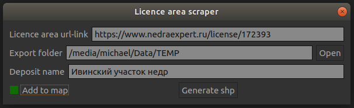
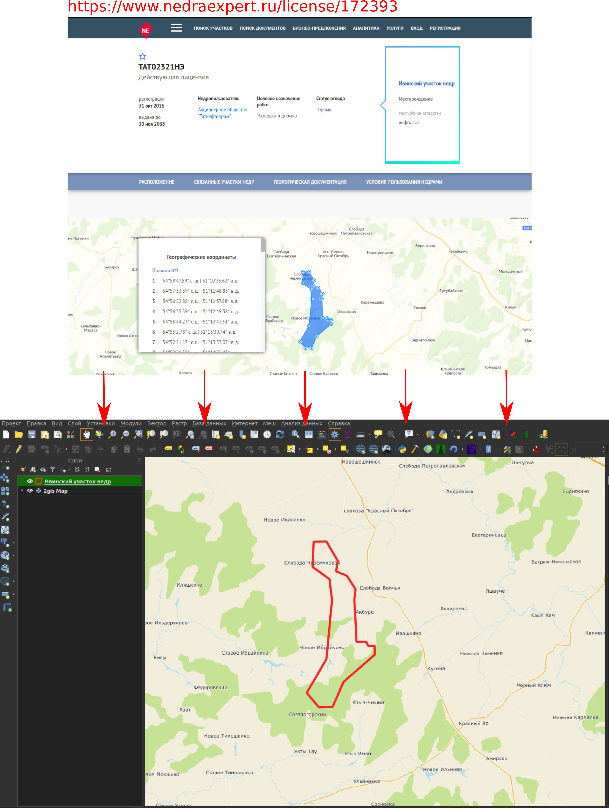

# QGIS-плагин для автоматического создания контура лицензионного участка на основе данных с интернет-источника

Плагин позволяет получить данные координат лицензионного участка с 
веб-страницы и сохранить их в виде shp-файла.

Для создания контура лицензионного участка необходима url-ссылка, с 
которой необходимо получить координаты, например, https://www.nedraexpert.ru/license/172393

*Внимание*

На данный момент плагин позволяет извлекать координаты только с сайта 
**nedraexpert.ru**. 

Если у Вас есть предложение создать подобную возможность 
конвертации координат с другого интернет-ресурса в формат shp-файла, пишите на почту: mihail.tchernov@yandex.ru

## Как установить
Для установки плагина перейдите в Модули-Управление и установка модулей, а 
затем в поиске введите название модуля: **Licence area scraper**. Далее нажать
"Установить".

На панели инструментов появится новая иконка. Также плагин можно будет 
найти во вкладке "Модули"

### Внешний вид окна плагина

## Как пользоваться
Для успешной отработки функционала плагина необходимо заполнить три поля:
  + **Licence area url-link**: в это поле нужно вставить ссылку на 
    веб-страницу 
  сайта nedraexpert.ru, с которой необходимо забрать координаты
    
  + **Export folder**: выбрать папку сохранения итогового shp-файла. Поле 
    доступно только для чтения, но выбрать папку можно путем нажатия на 
    кнопку ***open***
    
  + **Deposit name**: ввести название лицензионного участка

Если нужно автоматически добавить полигон участка на карту, то установите 
галочку ***Add to map***

Далее нажать кнопку **Generate shp**.

### Результат работы

